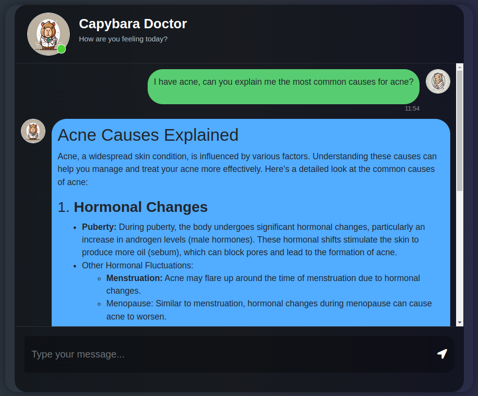
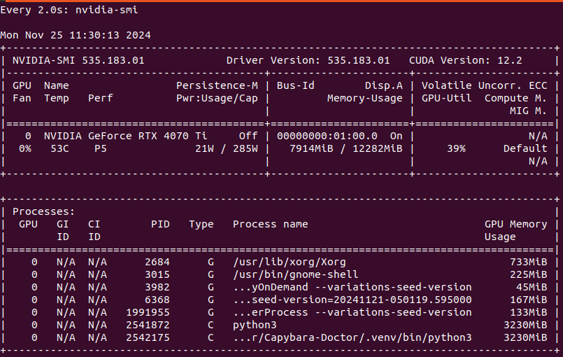

# Capybara Doctor: Your Local Medical Chatbot  

## 🚀 Overview  
**Capybara Doctor** is a locally hosted chatbot powered by a **Large Language Model (LLM)**, designed to provide insights and answers based on medical knowledge. By leveraging a **Retrieval-Augmented Generation (RAG)** structure, it combines conversational AI with a vector database to retrieve relevant information from medical books.  

### Key Features:
- **Locally Hosted**: Runs on your local machine, leveraging your hardware resources (GPU recommended).  
- **Customizable Configuration**: Easily tailor the models, parameters, and text processing using a `config.json` file.  
- **Vector Database Integration**: Uses [Pinecone](https://www.pinecone.io/) for storing and retrieving indexed medical knowledge.  
- **User-Friendly Frontend**: A simple and intuitive interface powered by [Flask](https://flask.palletsprojects.com/en/stable/) to interact with the bot.  

### Models in Use:
- **LLM**: [Qwen2.5-1.5B-Instruct](https://huggingface.co/Qwen/Qwen2.5-1.5B-Instruct)  
- **Embedding Model**: [all-MiniLM-L6-v2](https://huggingface.co/sentence-transformers/all-MiniLM-L6-v2)  

All models are sourced from [Hugging Face](https://huggingface.co/) and are integrated using [LangChain](https://www.langchain.com/) and [LangSmith](https://smith.langchain.com/) for enhanced monitoring and visibility.  

## 🕹️ Demo  

Experience the capabilities of **Capybara Doctor**, a chatbot designed to answer your medical questions based on the information provided in the uploaded PDFs.

⚠️ **Important Notice:**  
This chatbot is a demonstration of a potential use case for a Retrieval-Augmented Generation (RAG)-based chatbot. **It is NOT a substitute for professional medical advice.**  
Any medical statements made by the LLM should always be reviewed and validated by a qualified healthcare professional before taking any action.

### Example Interaction:  
Below is a sample interaction showcasing the chatbot in action:  
  

## 🛠️ Project Architecture  
The project is divided into three main components:  
1. **Vector Database Setup**: Prepares the Pinecone vector database with medical knowledge.  
2. **Backend**: Handles incoming user messages, retrieves relevant data from the vector database, and manages chatbot memory.  
3. **Frontend**: Provides the web interface for users to interact with the chatbot.  

## 📋 How to Run the Project  
Follow these steps to set up and run Capybara Doctor:  

1. **Clone the Repository**  
   ```bash
   git clone https://github.com/AlejandroAttento/Capybara-Doctor
   ```
2. **Create a Virtual Environment**  
   For Linux
   ```
   python3 -m venv .venv
   ```
3. **Activate Virtual Environment**  
   For Linux and macOS
   ```
   source .venv/bin/activate
   ```
   For Windows
   ```
   .venv\Scripts\activate
   ```
4. **Install Dependencies**
   ```
   pip install -r requirements.txt
   ```
5. **Set up Environment Variables**  
   Create a `.env` file in the root directory with the following values:
   * **PINECONE_TOKEN**: API token from [Pinecone](https://www.pinecone.io/).
   * **HUGGINGFACE_TOKEN**: API token from [Hugging Face](https://huggingface.co/).
   * **FLASK_APP_KEY**: A secret key (any random string) for Flask session signing.
   * **LANGCHAIN_API_KEY**: API key for [LangChain](https://www.langchain.com/).
6. **Initialize the Vector Database**
   Process and upload text data to the vector database:
   ```
   python3 ./store_index.py
   ```
   *Feel free to add more medical books to the data/ folder to enhance the chatbot’s knowledge.*
7. **Run the Chatbot**  
   Start the Flask server:
   ```
   python3 ./app.py
   ```
   Open [http://127.0.0.1:8080/](http://127.0.0.1:8080/) in your browser to interact with the bot.  
   ⚠️ *The first run may take longer as the models and tokenizer are downloaded.*

## Project Structure
The repository is organized as follows:

- **`data/`**: Contains the PDFs used for the Retrieval-Augmented Generation (RAG) process. Add your medical books here to enhance the chatbot's knowledge base.

- **`img/`**: Stores images used in the `README.md` file or other documentation.

- **`logs/`**: Directory where all the logs generated during the execution of the project are saved.

- **`model/`**: Contains the downloaded models once they are initialized and set up locally.

- **`src/`**: Contains all the source code files used in the project. This directory is installed as a local library.

- **`static/`**: Holds resources used by the front-end, such as CSS, JavaScript, or other static assets.

- **`templates/`**: Stores the HTML templates used by the front-end.

- **`app.py`**: The main executable file to start the chatbot.

- **`config.json`**: The configuration file for the project. Use this to customize models, parameters, and settings.

- **`logger.py`**: Provides logging functionalities for debugging and tracking execution.

- **`setup.py`**: Configuration to install the `src/` directory as a local library.

- **`store_index.py`**: Executable file to set up the Vector Database with Pinecone.

## ⚙️ Project Customization
The chatbot can be easily customized by editing the config.json file. Some configurable parameters include:

* **LLM Model**: Change the LLM or embedding model.
* **Text Processing**: Adjust chunk size and overlap for text indexing.
* **Vector DB Settings**: Update Pinecone configurations, such as index name or dimensions.
* **Model Parameters**: Fine-tune hyperparameters like temperature, token limits, and beam search settings.

### Default configuration
```
{
    "llm_model_repository_name": "Qwen/Qwen2.5-1.5B-Instruct",
    "embedding_model_name": "sentence-transformers/all-MiniLM-L6-v2",
    "data_directory": "data/",
    "model_directory": "model/",
    "pinecone": {
        "index_name": "capybara-doctor",
        "dimensions": 384,
        "metric": "cosine"
    },
    "text_split": {
        "chunk_size": 500, 
        "chunk_overlap": 50
    },
    "model_params": {
        "temperature": 0.3,
        "repetition_penalty": 1.5,
        "no_repeat_ngram_size": 3,
        "early_stopping": "True",
        "max_new_tokens": 350,
        "max_length": 1000,
        "do_sample": "True",
        "num_beams": 3
    }
}
```

## 🔄 Updating the Pinecone Vector Database
To update the vector database, use the following commands:
* **Initialize or Rebuild the Database**
   ```
   python3 ./store_index.py
   ```
   This creates the database (if not already present) and uploads all text data from the data/ folder.
* **Add New PDFs Without Duplicates**
   ```
   python3 ./store_index.py -deduplicate
   ```
   This ensures only new and unique chunks are added.
* **Regenerate the Database**
   ```
   python3 ./store_index.py regenerate
   ```
   Use this if you’ve changed the embedding model or removed files. It will drop the existing index and create a fresh one.

## 🖥️ Monitoring
To monitor the memory usage or your model using your GPU use the `watch nvidia-smi` command if you use Linux or macOS or the [task manager](https://www.youtube.com/watch?v=TD1DANRcch4&t=49s) if you use Windows.

 

## 💡 Notes:
* A GPU (RTX 4070 Ti or better) is recommended for optimal performance.
* Running the chatbot locally ensures privacy and control over data.

## 🤝 Contributing
Feel free to fork the repository and contribute! Suggestions, feature requests, and bug reports are welcome via [issues](https://github.com/AlejandroAttento/Capybara-Doctor/issues) or reach me out at [Linkedin](https://www.linkedin.com/in/alejandro-daniel-attento/).